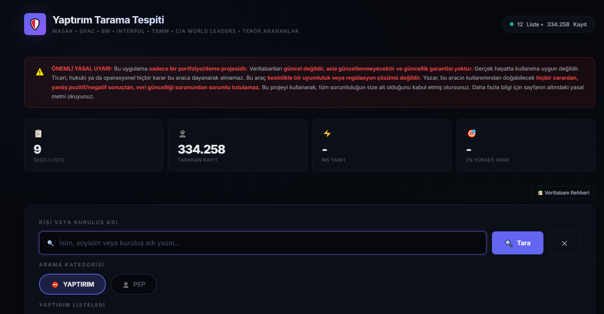
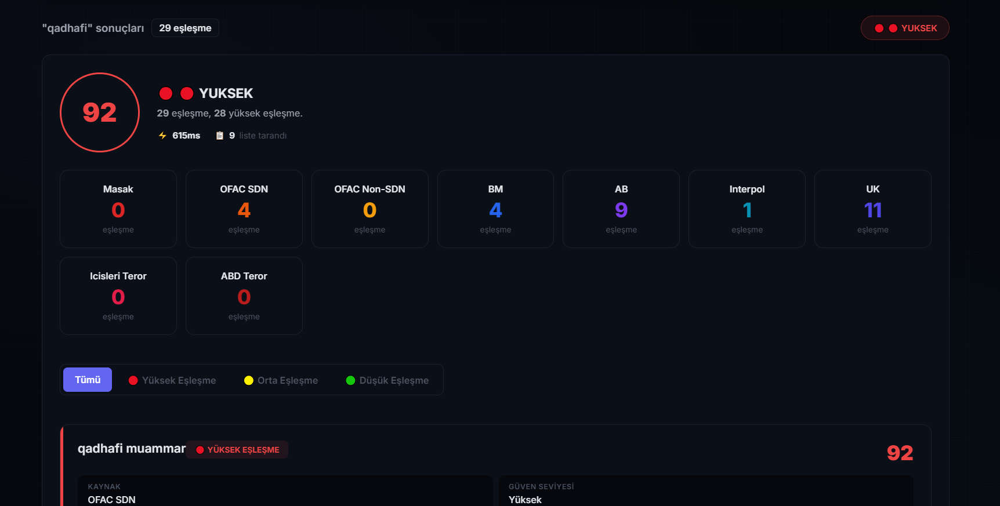
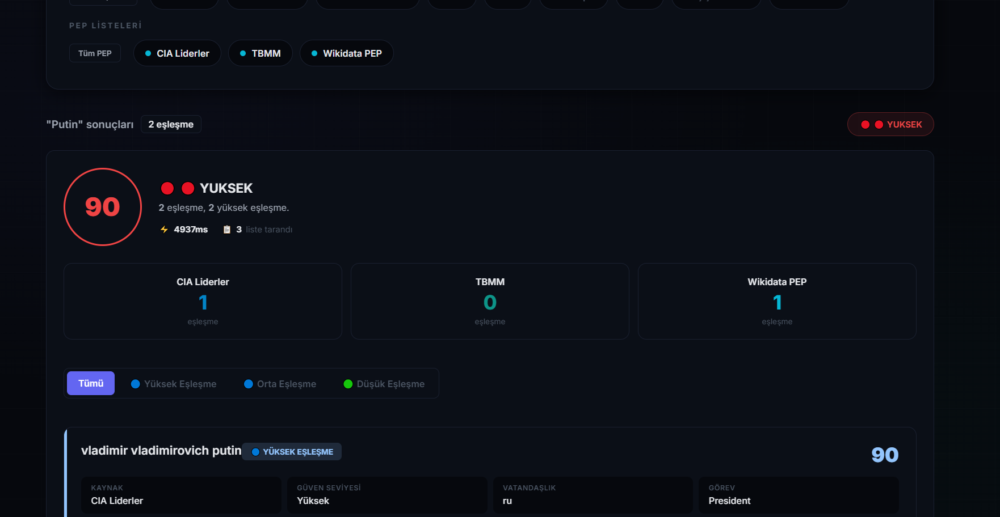
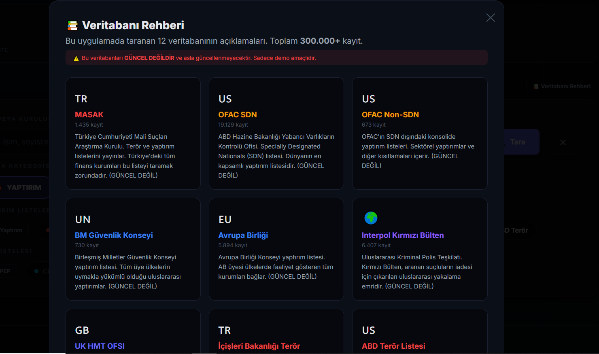
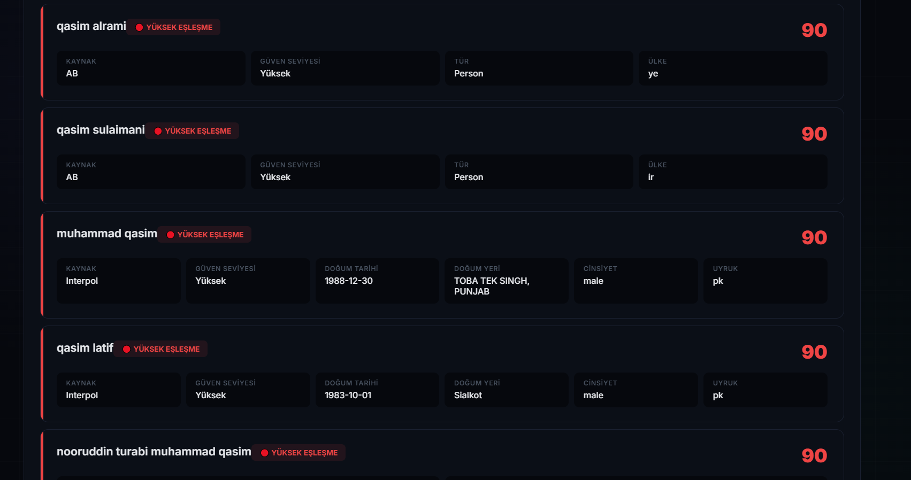

# 🛡️ YAPTIRIM TARAMA TESPİTİ

### Sanctions Screening & PEP Detection API

---

<div align="center">


**334.000+ kayıt • 12 veritabanı • Fuzzy String Matching • PEP & Yaptırım ayrımı • Modern koyu tema**

</div>

---

## 📖 Hakkında

**Yaptırım Tarama Tespiti**, bankaların, finans kuruluşlarının ve fintech şirketlerinin uymak zorunda olduğu **yaptırım listesi tarama (Sanctions Screening)** ve **politik nüfuz sahibi kişi tespiti (PEP Detection)** süreçlerini simüle eden, tam teşekküllü bir **RegTech (Regulatory Technology)** demo uygulamasıdır.

Bir isim veya kuruluş adı yazdığınızda, sistem 12 farklı uluslararası veritabanında **fuzzy string matching** algoritması ile arama yapar. Yazım hatalarına, Türkçe karakterlere, kelime sıralaması farklılıklarına karşı toleranslıdır. Sonuçları zengin meta-verilerle birlikte, modern bir koyu tema arayüzünde, renk kodlu risk seviyeleriyle sunar.

> ⚠️ **ÖNEMLİ:** Bu proje **sadece bir portfolyo ve demo çalışmasıdır.** Veritabanları **güncel değildir, asla güncellenmeyecektir.** Gerçek hayatta kullanıma uygun değildir. Detaylı bilgi için [Yasal Uyarı](#yasal-uyari) bölümünü okuyunuz.

---

## ✨ Neler Yapabilir?

| Özellik | Açıklama |
|---|---|
| 🔍 **Akıllı Arama** | Yazım hatalarına, Türkçe karakterlere, kelime sırasına toleranslı fuzzy matching |
| 📊 **12 Veritabanı** | MASAK, OFAC, BM, AB, Interpol, UK, CIA, TBMM, Wikidata PEP ve daha fazlası |
| 🎯 **Çift Mod** | PEP (mavi tonlar) ve Yaptırım (kırmızı tonlar) bağımsız kategoriler |
| ⚡ **Skor Sistemi** | %70-100 arası eşleşme skoru, YÜKSEK/ORTA/DÜŞÜK seviyeleri |
| 🎚️ **Dinamik Eşik** | Kullanıcı tarafından ayarlanabilir eşleşme eşiği (%70-100) |
| 🌐 **Modern UI** | Koyu tema, responsive tasarım, anlık filtreleme, tooltip'ler |
| 📋 **Zengin Kartlar** | Doğum tarihi, uyruk, örgüt, parti, görev, alias gibi ek bilgiler |
| 🔒 **Güvenlik** | API Key doğrulama, rate limiting, CORS koruması |
| 📚 **Veritabanı Rehberi** | Modal pencerede tüm veritabanlarının detaylı açıklamaları |

---

## 🎨 Ekran Görüntüleri

<div align="center">


*Ana sayfa - Arama kutusu, veritabanı seçimi, istatistik kartları*


*Yaptırım modunda arama sonucu - Kırmızı risk seviyeleri*


*PEP modunda arama sonucu - Mavi nüfuz seviyeleri*


*Veritabanı Rehberi modal penceresi - 12 veritabanının detaylı açıklamaları*


*Detaylı sonuç kartı - Meta-veriler, skor detayları*

</div>

### Kategoriler ve Renk Kodları

| Kategori | Yüksek Eşleşme | Orta Eşleşme | Düşük Eşleşme |
|---|---|---|---|
| **Yaptırım** | 🔴 Kırmızı | 🟡 Sarı | 🟢 Yeşil |
| **PEP** | 🔵 Açık Mavi | 🔵 Mavi | 🟢 Yeşil |

---

## 🛠️ Teknoloji Yığını

<div align="center">

| Backend | Fuzzy | Veri | Frontend | Deploy |
|---|---|---|---|---|
| FastAPI | thefuzz | pandas | HTML5 | Render |
| Uvicorn | python-Levenshtein | openpyxl | CSS3 | GitHub |
| Python 3.10+ | unicodedata | Excel/CSV | Vanilla JS | - |

</div>

---

## 🔑 API Anahtarı

Tüm tarama endpoint'leri `X-API-Key` header'ı gerektirir.

**Varsayılan anahtar:** `demo-key-2026`

Swagger'dan test etmek için sağ üstteki **Authorize** butonuna tıklayıp bu anahtarı girin.

---

## 📦 Kurulum

### Gereksinimler

- Python **3.10** veya üzeri
- pip

### 3 Adımda Çalıştır

```
# 1. Repoyu klonla
git clone https://github.com/qtrn0/yaptirim-tarama-tespiti.git
cd yaptirim-tarama-tespiti

# 2. Bağımlılıkları kur
pip install -r requirements.txt

# 3. Başlat
uvicorn app.main:app --reload
```

### 🚀 Kullanım
Web Arayüzü
```
    Arayüzü açın

    Arama Kategorisi seçin: YAPTIRIM veya PEP

    İstediğiniz veritabanlarını işaretleyin (veya "Tüm Yaptırım" / "Tüm PEP")

    Eşik değerini slider'dan ayarlayın (varsayılan: %75)

    İsim yazın, "Tara" butonuna basın

    Sonuçları inceleyin, filtreleyin, detayları görün
```
API
```
# Tekil tarama
curl -X POST "http://127.0.0.1:8000/screen" \
  -H "X-API-Key: demo-key-2026" \
  -H "Content-Type: application/json" \
  -d '{"isim": "Vladimir Putin", "listeler": ["OFAC SDN", "BM"], "esik": 75}'

# Health check
curl -X GET "http://127.0.0.1:8000/health"
Swagger dokümantasyonu: http://127.0.0.1:8000/docs
```

## 📊 Veritabanları

### ⛔ Yaptırım Listeleri (9 adet)

| # | Veritabanı | Kayıt | Kaynak |
|---|---|---|---|
| 1 | **MASAK** | 1.429 | Türkiye Mali Suçları Araştırma Kurulu |
| 2 | **OFAC SDN** | 19.096 | ABD Yabancı Varlıkların Kontrolü Ofisi |
| 3 | **OFAC Non-SDN** | 605 | OFAC Konsolide Yaptırımlar |
| 4 | **BM** | 729 | Birleşmiş Milletler Güvenlik Konseyi |
| 5 | **AB** | 5.891 | Avrupa Birliği Konseyi |
| 6 | **Interpol** | 6.337 | Interpol Kırmızı Bülten |
| 7 | **UK** | 4.992 | İngiltere Hazinesi OFSI |
| 8 | **İçişleri Terör** | 2.585 | Türkiye İçişleri Bakanlığı |
| 9 | **ABD Terör** | 94 | ABD Yabancı Terör Örgütleri |

### 👤 PEP Listeleri (3 adet)

| # | Veritabanı | Kayıt | Kaynak |
|---|---|---|---|
| 10 | **CIA Liderler** | 5.305 | CIA Dünya Liderleri Veritabanı |
| 11 | **TBMM** | 591 | Türkiye Büyük Millet Meclisi |
| 12 | **Wikidata PEP** | 286.589 | Küresel Politik Nüfuz Sahibi Kişiler |

---

## 📂 Proje Yapısı
```

yaptirim-tarama-tespiti/
├── app/
│ ├── main.py # FastAPI uygulaması, endpoint'ler
│ ├── scanner.py # Fuzzy tarama motoru
│ ├── skor_engine.py # Skor hesaplama ve risk belirleme
│ ├── cleaner.py # Regex ile veri temizleme
│ ├── data_loader.py # Excel/CSV veritabanı yükleme
│ └── models.py # Pydantic veri modelleri
├── data/ # 12 adet Excel/CSV veritabanı
├── screenshots/ # Ekran görüntüleri
├── static/
│ └── index.html # Modern koyu tema web arayüzü
├── requirements.txt
├── run.bat # Windows başlatma script'i
├── postman_collection.json # Postman API koleksiyonu
├── .gitignore
├── LICENSE
└── README.md
```

---

## 🔧 Yapılandırma

| Parametre | Varsayılan | Açıklama |
|---|---|---|
| `API_KEY` | `demo-key-2026` | API anahtarı (`app/main.py`) |
| Rate Limit | 100 istek/dakika | Değiştirilebilir |
| Eşleşme Eşikleri | 85 / 70 / 55 | YÜKSEK / ORTA / DÜŞÜK sınırları |
| Dinamik Eşik | 70-100 (varsayılan: 75) | Frontend slider ile ayarlanabilir |


<a name="yasal-uyari"></a>

## ⚠️ YASAL UYARI VE SORUMLULUK REDDİ

<div align="center">

# 🛑 BU PROJE SADECE BİR PORTFOLYO VE DEMO ÇALIŞMASIDIR 🛑

</div>

> ### Kullanım Koşulları
> 
> Bu yazılımı (`Yaptırım Tarama Tespiti`) kullanarak, aşağıdaki koşulların tamamını okuduğunuzu, anladığınızı ve **kayıtsız şartsız kabul ettiğinizi** beyan etmiş olursunuz:
> 
> ---
> 
> ### ❌ BU YAZILIM:
> 
> - **Ticari kullanıma uygun değildir.** Herhangi bir ticari faaliyette kullanılamaz, satılamaz, kiralanamaz.
> - **Gerçek hayatta kullanıma uygun değildir.** Bankacılık, finans, hukuk, güvenlik veya herhangi bir operasyonel süreçte kullanılamaz.
> - **Bir uyumluluk (compliance) çözümü değildir.** KYC (Müşterini Tanı), AML (Kara Para Aklamayı Önleme), yaptırım taraması veya herhangi bir yasal zorunluluk için kullanılamaz.
> - **Veritabanları güncel değildir.** Bu projede yer alan hiçbir veritabanı güncel değildir ve **asla güncellenmeyecektir.** Veriler yanlış, eksik veya güncelliğini yitirmiş olabilir.
> - **Resmi bir kaynak değildir.** MASAK, OFAC, BM, Interpol veya herhangi bir resmi kurumla hiçbir bağlantısı yoktur.
> 
> ---
> 
> ### ⚠️ SORUMLULUK REDDİ:
> 
> Bu yazılım **"olduğu gibi" (as-is)** sunulmaktadır. Yazar (`qtrn0`), bu yazılımın kullanımından veya kullanılamamasından doğabilecek **hiçbir doğrudan, dolaylı, arızi, özel veya sonuç olarak ortaya çıkan zarardan sorumlu tutulamaz.** Bu zararlar şunları içerir ancak bunlarla sınırlı değildir:
> 
> - Yanlış pozitif (false positive) veya yanlış negatif (false negative) eşleşmeler
> - Veri güncelliği veya doğruluğu sorunları
> - Maddi kayıplar, cezalar, yasal yaptırımlar
> - İtibar kaybı, iş kaybı, müşteri kaybı
> - Üçüncü kişilerin uğrayabileceği her türlü zarar
> 
> **Bu yazılımı kullanan kişi, tüm riski ve sorumluluğu tamamen üstlenir. Yazar hiçbir sorumluluk kabul etmez.**
> 
> ---
> 
> ### 📌 BEYAN:
> 
> - Bu proje **finansal gelir elde etme amacı taşımaz.**
> - Bu proje **sadece GitHub portfolyosunda sergilenmek üzere** oluşturulmuştur.
> - Bu proje bir **eğitim ve öğrenme çalışmasıdır.**
> 
> ---
> 
> **Son güncelleme: Temmuz 2026**
    
### 📄 Lisans

Bu proje MIT Lisansı altında lisanslanmıştır. Lisans, yazılımın kullanımına izin verir ancak hiçbir garanti veya sorumluluk kabul etmez. Detaylar için LICENSE dosyasını inceleyiniz.
<div align="center">

Bu proje bir portfolyo çalışmasıdır. Gerçek hayatta kullanıma uygun değildir.
</div> ```
